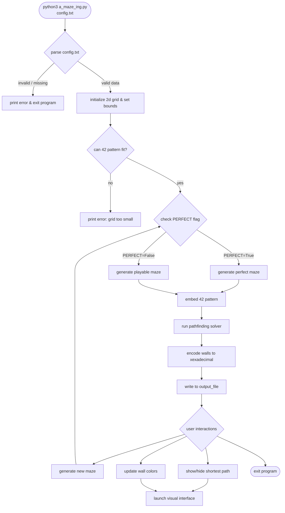

# GUIDE

"Interestingly, perfect mazes (with one unique path between any two points) are directly related to spanning trees in graph theory."

"Some famous algorithms used for maze generation, like Prim’s, Kruskal’s, or
the recursive backtracker,"

# GUIDELINES

- Python 3.10 or later
- Handle potential errors (use try-except)
- Prefer Context Managers (https://www.geeksforgeeks.org/python/context-manager-in-python)

The purpose of the A-Maze-ing project ia to create our own maze generator and display its result. Beyond just generating a maze, the project serves some of educational goals including but not limited to:
- randomness
- graph theory
- code reusability and packaging: one of the major structural purpose of the project is to teach us how to write modular code. 

# TODO

## Guidelines

- [ ] set up a virtual environment
- [ ] include a Makefile with the following rules: install, run, debug, clean, lint, lint-strict
- [ ] use pytest or unittest frameworks for test purposes 
- [ ] include .gitignore
- [ ] handle all possible exceptions

- [ ] create config.txt file thst defines the maze generation options. (means that we need a parser to parse "=", "#" etc.)

### maze
- [ ] create a standalone module containing a MazeGenerator class
- [ ] implement ranodm maze generation that supports reproducibility via a seed is provided
- [ ] ensure cells have 0 to 4 walls
- [ ] ensure entry and exit exist
- [ ] ensure enttru and exit are different
- [ ] ensure entry and exit points are inside maze bound
- [ ] no dead-end 
- [ ] two neighbor cells must share the same wall if any
- [ ] 2x3 open area at most
- [ ] 42 pattern (can be tolerated if the maze size doesn't allow -> print an error message in case)
- [ ] default mode: PERFECT=False - no/rare dead-ends, open corners, center, at least two independent loops
- [ ] PERFECT=True - ensure exactly one path between entry and exit 

### output
- [ ] encode each cell as a single hexadecimal digit representing closed walls

### documentation & packaging
- [ ] implement the maze generation as a class (MazeGenerator) for a later installation by pip
- [ ] documentatation
- [ ] add LICENSE.md for software licensing. needed 

### user interactions
- [ ] re-generate a new maze and display it
- [ ] show/hide a valif shortest path (entry -> exit)
- [ ] change maze wall colors
- [ ] set colors of 42 pattern (opt)